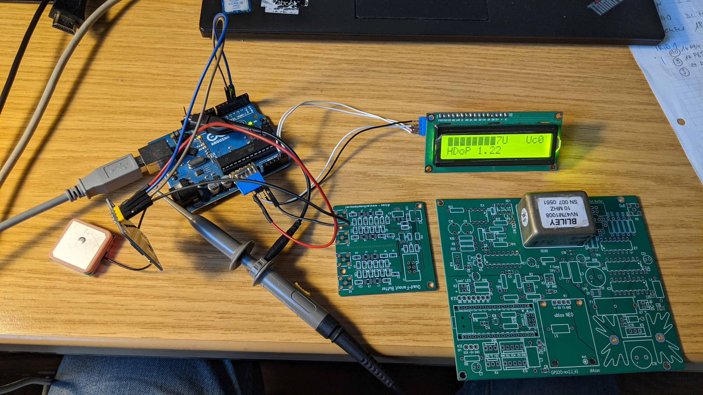

# gpsdo
gpsdo with clock generator

simple gpsdo project from dl4za0 with additional si5351 clock generator.

GPSDO rev2.2_43

#### Firmware
- firmware_01.hex - initial firmware of the project
- firmware_02.hex - firmware with lcd output and dac control
- gpsdo.hex - hex file of the arduino code with dac control and si5351 clock controller
- optiboot_atmega328.hex - sometimes it is necessary to reprogram the booloader

Makefile - just for programming the hex-files

copy desired hex-file to firmware.hex. program with 'make program'

programming only works for arduino nano with Atmega328p chip

I have used avr dragon isp for programming connected to arduino 6pin-connector
#### 
